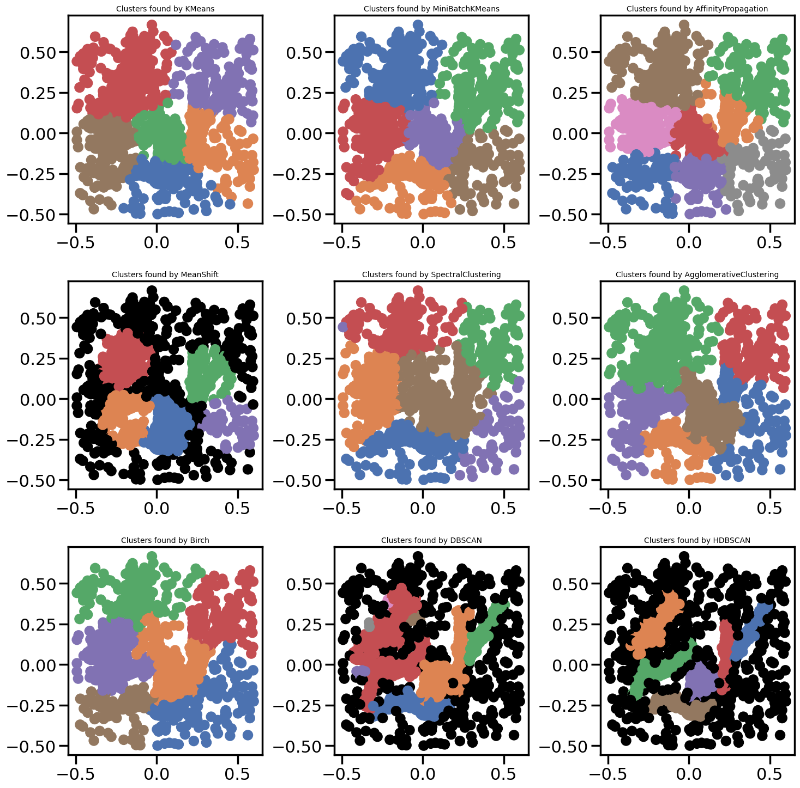

# Comparing Clustering Algorithms: A Comprehensive Analysis

----------------------------------------------

## Introduction

Clustering is a fundamental task in unsupervised machine learning, aimed at grouping similar data points together. This repository contains a notebook where we explore and compare the performance of nine popular clustering algorithms using Python's scikit-learn library and HDBSCAN.

## Objective

The main objective of this notebook is to compare the effectiveness and characteristics of different clustering algorithms. By examining a diverse set of clustering methods, we aim to understand their strengths, weaknesses, and suitability for different types of data and clustering tasks.

## Overview of Clustering Algorithms

1. **KMeans**
2. **MiniBatchKMeans**
3. **AffinityPropagation**
4. **MeanShift**
5. **SpectralClustering**
6. **AgglomerativeClustering**
7. **Birch**
8. **DBSCAN**
9. **HDBSCAN**

## Methodology

- Each algorithm is applied to the same dataset.
- We evaluate the clustering results based on their computational time and the quality of clusters formed.
- Visualizations are provided to illustrate the clustering output for each algorithm.

## Conclusion

By comparing these clustering algorithms, we aim to provide insights into their behavior and applicability across different scenarios. Understanding these algorithms can help in selecting the most suitable clustering technique for specific datasets and problem domains.

